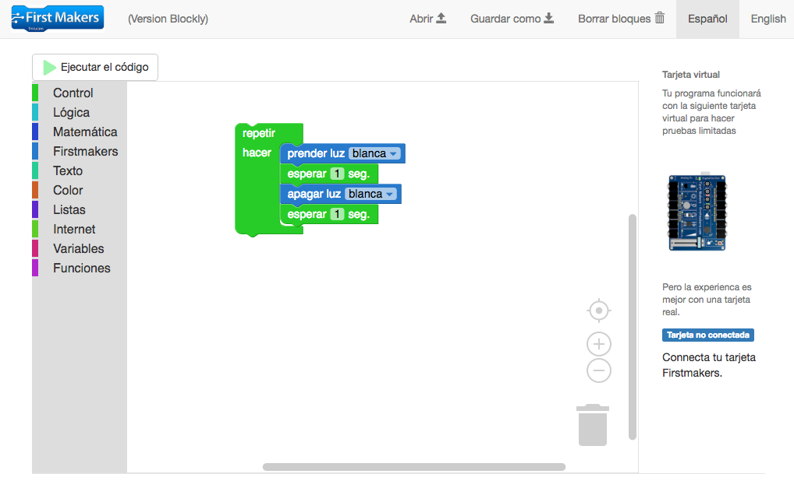

# Firstmakers-Blockly
First makers is an initiative aimed at making easy the adventure of programming our physical environment and allowing ordinary people to build the Internet of things.

First makers includes hardware (e.g. a shield that can be placed on top of Arduino boards with built-in sensors and plugs to connect external sensors/actuators), software (Block based software to program electronic boards) and cloud services (save and share your data).

This repository contains the base code for Firstmakers "Blockly version", based on Google's blockly software (https://developers.google.com/blockly/).

Architecture overview
-------
Firstmakers-blockly is an html/javascript application that runs embedded in a Desktop app using nwjs (formerly node-webkit).  It combines the power of traditional javascript libraries (such as blockly) with nodejs modules (which allow communication through usb/serial ports).

The code is structured using AngularJS 1.5 and has the following main dependencies:

  - AngularJS (Javascript framework)
  - Blockly (Javascript library)
  - Bootstrap (js/css library)
  - UnderscoreJS (Javascript library)
  - Angular-Translate (Javascript library to manage multi language)
  - Firmata (nodejs module)
  - Serialport (nodejs module)
  

  

 
